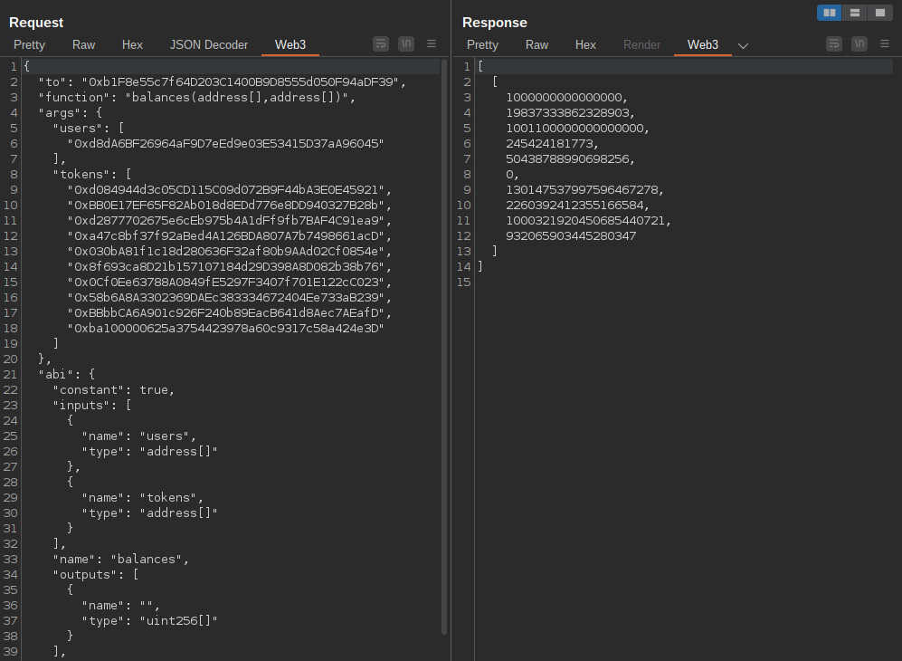
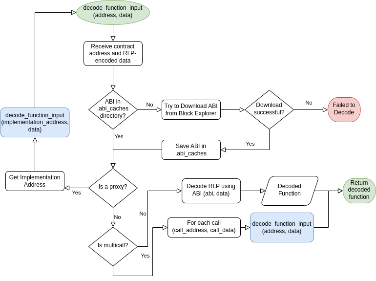

# Web3 Decoder

Web3 Decoder is a Burp Suite Extension that helps to analyze what is going on
with the operations involving smart contracts of the web3. This is mainly JSON-RPC calls to Ethereum Nodes,
and nodes of other compatible networks (like Polygon, Arbitrum, BSC...)

## Block explorers API Keys

Most block explorers supported, like [etherscan.io](https://etherscan.io) require an API key to allow more than 1 request each 5 seconds.

To add your API keys you have 2 options:

* You can add your API keys modifying the [.api_keys.json](.api_keys.json) file
* You can add Environment variables with the same names as the ones in the API_KEYS.json file
  * e.g.: export ETHERSCAN_API=YOURAPIKEY

## Manually adding a contract's ABI

The extension caches the downloaded ABIs from the block explorers like etherscan
inside a folder named `.abi_caches` in JSON format. You can simply add a new file inside that folder, 
with the following naming convention:

{chain_id}_{contract_address.lower()}.abi

For example:

~~~
# Ethereum Mainnet (chain ID 1), contract 0xfbdca68601f835b27790d98bbb8ec7f05fdeaa9b
1_0xfbdca68601f835b27790d98bbb8ec7f05fdeaa9b.abi

# Polygon (chain id 137), contract 0x447646e84498552e62ecf097cc305eabfff09308
137_0x447646e84498552e62ecf097cc305eabfff09308.abi
~~~

## Precompiled Binaries and Python3 Virtualenv

This extension requires python3 libraries like web3.py that unfortunately are not available for python 2.7
to be used directly with Jython 2.7. As a 'hack', the main functionality is written in a python 3 library
that is being executed by the extension through a python virtual environment (talking about dirty...)

I have created precompiled binaries of the python3 library used, for Linux, Windows and Mac OSX.
The extension will use these binaries if it is not able to execute the library. 
For better performance or development, you can create a virtualenv, and install as follows:

~~~shell
git clone https://github.com/nccgroup/web3-decoder 
cd "web3-decoder"
virtualenv -p python3 venv
source venv/bin/activate
pip install web3 py-evm
~~~

The extension will make calls to the library using the created virtualenv.

Once the virtualenv is created, you can add the python extension by selecting the burp_web3_decoder.py file in the Extender
tab of Burp Suite

## Features and TODOs

- [x] Burp EditorTab added to compatible Requests and Responses
- [x] Decode of `eth_call` JSON-RPC calls
- [x] Decode of `eth_sendRawTransaction` JSON-RPC calls (and their inner functions)
- [x] Decode of response results from `eth_call`
- [x] Support for re-encoding of `eth_call` decoded functions
- [x] Automatic download of the smart contract ABI called from etherscan APIs (if the contract is verified)
- [x] Decode of function inputs both in `eth_call` and `eth_sendRawTransaction`
- [x] Decode of function inputs that uses "Delegate Proxy" contracts
- [x] Decode of function inputs called via "Multicall" contracts
- [x] Manual addition of contract ABIs for contracts that are not verified in etherscan
  - [ ] Allow to make this from Burp interface, instead of writing the JSON to a file
- [x] Pre-compiled binaries to allow the extension to work without setup
- [x] Support for other compatible networks (Polygon, Arbitrum, Fantom, BSC, etc.)
- [ ] Support for re-signing a modified decoded rawTransaction (requires input of privateKey)

## Chains Supported so far

All supported chains can be found in the [chains.json](chains.json) file.
These are chains that have a block explorer with the same APIs as etherscan.
If you want to add more blockchain explorers, add them to the [chains.json](chains.json) file, test it, and make a pull request!

* Ethereum Mainnet
* Ropsten
* Rinkeby
* Goerli
* Optimism
* Cronos
* Kovan
* BSC
* Huobi ECO
* Polygon
* Fantom
* Arbitrum
* Sepolia
* Aurora
* Avalanche

## Examples

For more examples, including proxy and multicall calls, see the [EXAMPLES.md](docs/EXAMPLES.md)

**eth_call**:

Raw:

Decoded:

**eth_sendRawTransaction** (Uniswap v2 test):

~~~json
{
    "method": "eth_sendRawTransaction", 
    "params": [
        "0x02f9015b820539808459682f00850df8475800830493e0947a250d5630b4cf539739df2c5dacb4c659f2488d880de0b6b3a7640000b8e47ff36ab500000000000000000000000000000000000000000000009e0950598867d8000000000000000000000000000000000000000000000000000000000000000000800000000000000000000000002105eaa660ff62b14a5e093fc348e13ab63af2e600000000000000000000000000000000000000000000000000000000623b16570000000000000000000000000000000000000000000000000000000000000002000000000000000000000000c02aaa39b223fe8d0a0e5c4f27ead9083c756cc20000000000000000000000006b175474e89094c44da98b954eedeac495271d0fc001a005cfdf9ff11dea2d3e8781cb6ba140ae6e86a0922bfa75938b6f2456f513e24ca057f02b3f7125edb59e22651d503bc296153860e3843f9d495ad21d898c8e20c3"
    ], 
    "id": 4700418092893, 
    "jsonrpc": "2.0"
}
~~~

Decoded:

~~~json
[
  {
    "chain_id": 1337, 
    "access_list": [], 
    "nonce": 0, 
    "r": 2628844986784880378434698689940765181553490914879903463877191830852582236748, 
    "s": 39775559607776431912363889945449043629789293388076288013264795388376358199491, 
    "max_priority_fee_per_gas": 1500000000, 
    "gas": 300000, 
    "max_fee_per_gas": 60000000000, 
    "from": "0x2105Eaa660ff62b14a5e093fc348e13ab63AF2E6", 
    "y_parity": 1, 
    "to": "0x7a250d5630B4cF539739dF2C5dAcb4c659F2488D", 
    "value": 1000000000000000000,
    "data": "0x7ff36ab500000000000000000000000000000000000000000000009e0950598867d8000000000000000000000000000000000000000000000000000000000000000000800000000000000000000000002105eaa660ff62b14a5e093fc348e13ab63af2e600000000000000000000000000000000000000000000000000000000623b16570000000000000000000000000000000000000000000000000000000000000002000000000000000000000000c02aaa39b223fe8d0a0e5c4f27ead9083c756cc20000000000000000000000006b175474e89094c44da98b954eedeac495271d0f", 
    "decoded_function": {
      "args": {
        "amountOutMin": 2915256698432979992576, 
        "path": [
          "0xC02aaA39b223FE8D0A0e5C4F27eAD9083C756Cc2", 
          "0x6B175474E89094C44Da98b954EedeAC495271d0F"
        ], 
        "to": "0x2105Eaa660ff62b14a5e093fc348e13ab63AF2E6", 
        "deadline": 1648039511
      }, 
      "function": "swapExactETHForTokens(uint256,address[],address,uint256)", 
      "to": "0x7a250d5630B4cF539739dF2C5dAcb4c659F2488D",
      "abi": {
        "outputs": [
          {
            "internalType": "uint256[]", 
            "type": "uint256[]", 
            "name": "amounts"
          }
        ], 
        "inputs": [
          {
            "internalType": "uint256", 
            "type": "uint256", 
            "name": "amountOutMin"
          }, 
          {
            "internalType": "address[]", 
            "type": "address[]", 
            "name": "path"
          }, 
          {
            "internalType": "address", 
            "type": "address", 
            "name": "to"
          }, 
          {
            "internalType": "uint256", 
            "type": "uint256", 
            "name": "deadline"
          }
        ], 
        "stateMutability": "payable", 
        "type": "function", 
        "name": "swapExactETHForTokens"
      }
    }
  }
]
~~~

## How it works

eth_chainId JSON-RPC request to the node in use to detect which chain we are working on, and depending on the chain, 
selects a block explorer API, by searching in the chains.json file.

As an example of use, to decode function calls, we need the ABI (Application Binary Interface) of the contract, 
which contains all functions that can be called in the contract and their inputs and outputs. For now, it works with 
verified contracts in the block explorer, or by manually adding the ABI. In future releases, we will explore 
the possibility of automatically generating an ABI by searching the function selectors in public databases.

The following "flow" diagram shows in a simplified way the process that the eth_decoder library follows when decoding 
eth_call JSON-RPC calls:

## Known Limitations

* Decoding raw transactions in Windows is not possible due to one of the libraries used not available in Windows
g